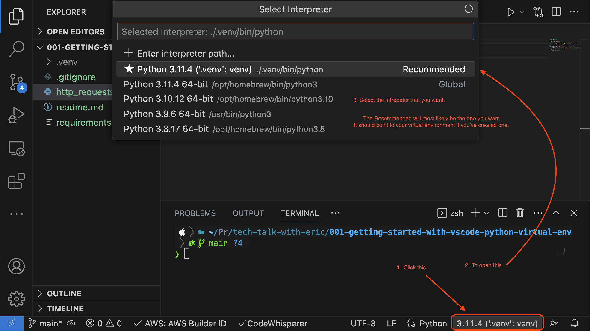

# project setup

## Watch the tutorial
🖥️ [YouTube](https://www.youtube.com/watch?v=jR8swMXyTIU)

## Install a Virtual Environment

Use the built in python3 moduled venv to create a virtual directory.

```sh
python3 -m venv .venv
```

## activate your environment

mac/linux
```sh
source ./.venv/bin/activate
```

windows

```sh
.venv/bin/Activate.ps1
```

## validate

when you check which/where python/python3, the location should be pointing to the virtual environment (directory) that you just created and activated

mac/linux

```sh
which python
which python3
```

window os
```sh
where python
where python3
```

## install our required modules

```sh
pip install -r requirements.txt
```

## Test our function
```sh
python http_requests.py
```

## Trouble shooting
- ensure that the python is using the virtual environment
    - `which python`
    - `where python`
- ensure that vs code is pointing the interpreter to the virtual environment




